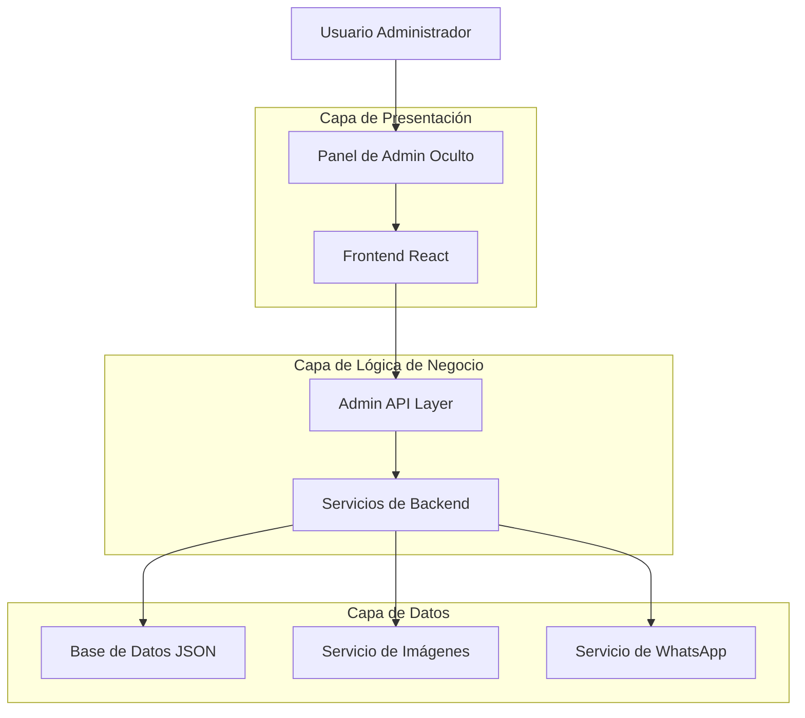
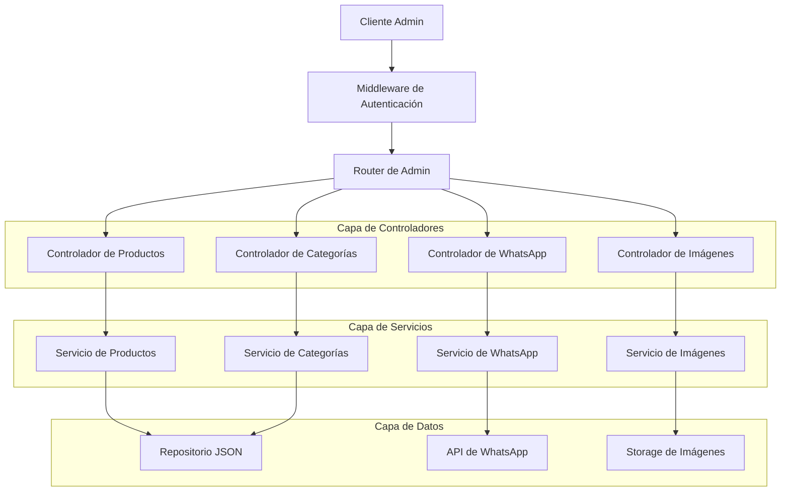
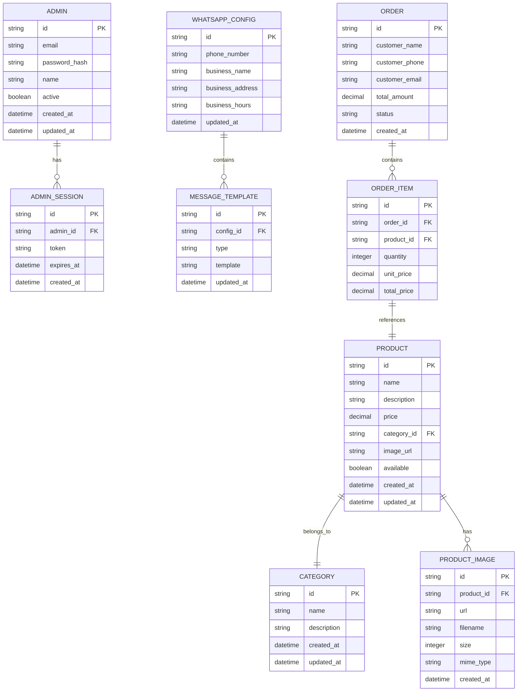
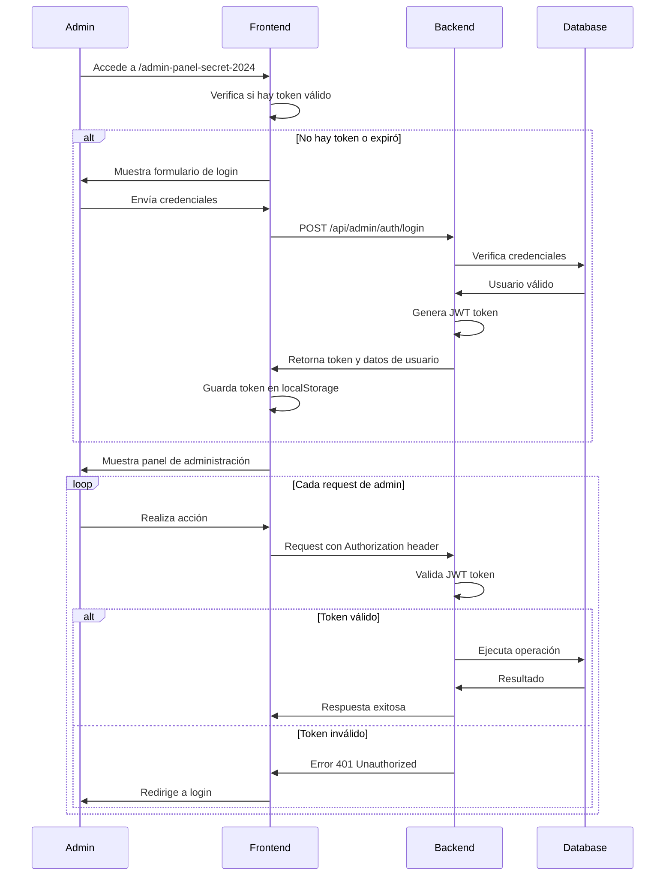

# Arquitectura Técnica - Sistema de Administración

## 1. Arquitectura General del Sistema



## 2. Stack Tecnológico

### 2.1 Frontend
- **React 18**: Framework principal
- **TypeScript**: Tipado estático
- **Tailwind CSS**: Estilos y diseño responsivo
- **Vite**: Herramienta de build y desarrollo
- **React Router**: Navegación y rutas
- **Zustand**: Gestión de estado global

### 2.2 Backend (Simulado)
- **JSON Files**: Base de datos temporal
- **Local Storage**: Persistencia del lado del cliente
- **File System API**: Gestión de archivos
- **Fetch API**: Comunicación HTTP

### 2.3 Servicios Externos
- **WhatsApp Business API**: Integración de mensajería
- **Image Upload Service**: Gestión de imágenes
- **AI Image Generation**: Generación automática de imágenes

## 3. Definición de Rutas

### 3.1 Rutas Públicas
| Ruta | Propósito |
|------|----------|
| `/` | Página principal de la tienda |
| `/catalog` | Catálogo de productos |
| `/orders` | Página de pedidos |

### 3.2 Rutas de Administración
| Ruta | Propósito | Acceso |
|------|-----------|--------|
| `/admin-panel-secret-2024` | Panel principal de administración | Solo admin |
| `/admin-panel-secret-2024/products` | Gestión de productos | Solo admin |
| `/admin-panel-secret-2024/whatsapp` | Configuración de WhatsApp | Solo admin |
| `/admin-panel-secret-2024/categories` | Gestión de categorías | Solo admin |
| `/admin-panel-secret-2024/settings` | Configuraciones generales | Solo admin |

## 4. API Definitions

### 4.1 Autenticación

#### POST /api/admin/auth/login
**Descripción**: Autenticación de administrador

**Request**:
| Parámetro | Tipo | Requerido | Descripción |
|-----------|------|-----------|-------------|
| email | string | true | Email del administrador |
| password | string | true | Contraseña |

**Response**:
| Parámetro | Tipo | Descripción |
|-----------|------|-------------|
| success | boolean | Estado de la autenticación |
| token | string | JWT token para autenticación |
| user | object | Información del usuario |

**Ejemplo**:
```json
{
  "email": "admin@tienda.com",
  "password": "AdminSecret2024!"
}
```

#### POST /api/admin/auth/logout
**Descripción**: Cerrar sesión de administrador

### 4.2 Gestión de Productos

#### GET /api/admin/products
**Descripción**: Obtener todos los productos con información de administración

**Response**:
| Parámetro | Tipo | Descripción |
|-----------|------|-------------|
| products | array | Lista de productos |
| total | number | Total de productos |
| categories | array | Categorías disponibles |

#### POST /api/admin/products
**Descripción**: Crear nuevo producto

**Request**:
| Parámetro | Tipo | Requerido | Descripción |
|-----------|------|-----------|-------------|
| name | string | true | Nombre del producto |
| description | string | true | Descripción del producto |
| price | number | true | Precio del producto |
| category | string | true | ID de la categoría |
| image_url | string | false | URL de la imagen |
| image_file | file | false | Archivo de imagen |
| available | boolean | false | Disponibilidad (default: true) |

**Response**:
| Parámetro | Tipo | Descripción |
|-----------|------|-------------|
| success | boolean | Estado de la operación |
| product | object | Producto creado |
| message | string | Mensaje de confirmación |

#### PUT /api/admin/products/{id}
**Descripción**: Actualizar producto existente

**Request**: Mismos parámetros que POST, todos opcionales

#### DELETE /api/admin/products/{id}
**Descripción**: Eliminar producto

**Query Parameters**:
| Parámetro | Tipo | Descripción |
|-----------|------|-------------|
| soft | boolean | Eliminación suave (default: true) |

### 4.3 Gestión de Imágenes

#### POST /api/admin/images/upload
**Descripción**: Subir imagen de producto

**Request**:
| Parámetro | Tipo | Requerido | Descripción |
|-----------|------|-----------|-------------|
| file | file | true | Archivo de imagen |
| product_id | string | false | ID del producto asociado |

**Response**:
| Parámetro | Tipo | Descripción |
|-----------|------|-------------|
| success | boolean | Estado de la subida |
| url | string | URL de la imagen subida |
| filename | string | Nombre del archivo |

#### POST /api/admin/images/generate
**Descripción**: Generar imagen con AI

**Request**:
| Parámetro | Tipo | Requerido | Descripción |
|-----------|------|-----------|-------------|
| prompt | string | true | Descripción para generar imagen |
| style | string | false | Estilo de imagen |
| size | string | false | Tamaño de imagen |

### 4.4 Configuración de WhatsApp

#### GET /api/admin/whatsapp/config
**Descripción**: Obtener configuración actual de WhatsApp

#### PUT /api/admin/whatsapp/config
**Descripción**: Actualizar configuración de WhatsApp

**Request**:
| Parámetro | Tipo | Requerido | Descripción |
|-----------|------|-----------|-------------|
| phoneNumber | string | true | Número de WhatsApp |
| businessName | string | true | Nombre del negocio |
| businessAddress | string | false | Dirección del negocio |
| businessHours | string | false | Horarios de atención |
| messages | object | false | Plantillas de mensajes |

#### POST /api/admin/whatsapp/test
**Descripción**: Probar configuración de WhatsApp

**Request**:
| Parámetro | Tipo | Requerido | Descripción |
|-----------|------|-----------|-------------|
| phoneNumber | string | true | Número de prueba |
| messageType | string | true | Tipo de mensaje a probar |

### 4.5 Gestión de Categorías

#### GET /api/admin/categories
**Descripción**: Obtener todas las categorías

#### POST /api/admin/categories
**Descripción**: Crear nueva categoría

**Request**:
| Parámetro | Tipo | Requerido | Descripción |
|-----------|------|-----------|-------------|
| id | string | true | ID único de la categoría |
| name | string | true | Nombre de la categoría |
| description | string | false | Descripción de la categoría |

#### PUT /api/admin/categories/{id}
**Descripción**: Actualizar categoría

#### DELETE /api/admin/categories/{id}
**Descripción**: Eliminar categoría

## 5. Arquitectura del Servidor



## 6. Modelo de Datos

### 6.1 Diagrama de Entidades



### 6.2 Definición de Datos (DDL)

#### Tabla de Administradores
```sql
-- Crear tabla de administradores
CREATE TABLE admins (
    id UUID PRIMARY KEY DEFAULT gen_random_uuid(),
    email VARCHAR(255) UNIQUE NOT NULL,
    password_hash VARCHAR(255) NOT NULL,
    name VARCHAR(100) NOT NULL,
    active BOOLEAN DEFAULT true,
    created_at TIMESTAMP WITH TIME ZONE DEFAULT NOW(),
    updated_at TIMESTAMP WITH TIME ZONE DEFAULT NOW()
);

-- Crear índices
CREATE INDEX idx_admins_email ON admins(email);
CREATE INDEX idx_admins_active ON admins(active);

-- Datos iniciales
INSERT INTO admins (email, password_hash, name) VALUES 
('admin@tienda.com', '$2b$10$hashedpassword', 'Administrador Principal');
```

#### Tabla de Sesiones de Admin
```sql
-- Crear tabla de sesiones
CREATE TABLE admin_sessions (
    id UUID PRIMARY KEY DEFAULT gen_random_uuid(),
    admin_id UUID REFERENCES admins(id) ON DELETE CASCADE,
    token VARCHAR(500) NOT NULL,
    expires_at TIMESTAMP WITH TIME ZONE NOT NULL,
    created_at TIMESTAMP WITH TIME ZONE DEFAULT NOW()
);

-- Crear índices
CREATE INDEX idx_admin_sessions_token ON admin_sessions(token);
CREATE INDEX idx_admin_sessions_admin_id ON admin_sessions(admin_id);
CREATE INDEX idx_admin_sessions_expires_at ON admin_sessions(expires_at);
```

#### Tabla de Productos (Extendida)
```sql
-- Crear tabla de productos
CREATE TABLE products (
    id VARCHAR(50) PRIMARY KEY,
    name VARCHAR(255) NOT NULL,
    description TEXT,
    price DECIMAL(10,2) NOT NULL,
    category_id VARCHAR(50) REFERENCES categories(id),
    image_url TEXT,
    available BOOLEAN DEFAULT true,
    created_at TIMESTAMP WITH TIME ZONE DEFAULT NOW(),
    updated_at TIMESTAMP WITH TIME ZONE DEFAULT NOW()
);

-- Crear índices
CREATE INDEX idx_products_category ON products(category_id);
CREATE INDEX idx_products_available ON products(available);
CREATE INDEX idx_products_price ON products(price);
CREATE INDEX idx_products_created_at ON products(created_at DESC);

-- Datos iniciales (migrar desde JSON)
INSERT INTO products (id, name, description, price, category_id, image_url, available)
SELECT 
    id,
    name,
    description,
    price,
    category,
    image_url,
    available
FROM json_products_import;
```

#### Tabla de Categorías
```sql
-- Crear tabla de categorías
CREATE TABLE categories (
    id VARCHAR(50) PRIMARY KEY,
    name VARCHAR(100) NOT NULL,
    description TEXT,
    created_at TIMESTAMP WITH TIME ZONE DEFAULT NOW(),
    updated_at TIMESTAMP WITH TIME ZONE DEFAULT NOW()
);

-- Datos iniciales
INSERT INTO categories (id, name, description) VALUES 
('zapatillas', 'Zapatillas', 'Calzado deportivo y casual para todas las ocasiones'),
('ropa', 'Ropa', 'Vestimenta cómoda y moderna para el día a día'),
('bolsos', 'Bolsos', 'Accesorios prácticos y elegantes para llevar tus pertenencias'),
('otros', 'Otros', 'Accesorios y productos diversos para complementar tu estilo');
```

#### Tabla de Imágenes de Productos
```sql
-- Crear tabla de imágenes
CREATE TABLE product_images (
    id UUID PRIMARY KEY DEFAULT gen_random_uuid(),
    product_id VARCHAR(50) REFERENCES products(id) ON DELETE CASCADE,
    url TEXT NOT NULL,
    filename VARCHAR(255),
    size INTEGER,
    mime_type VARCHAR(100),
    created_at TIMESTAMP WITH TIME ZONE DEFAULT NOW()
);

-- Crear índices
CREATE INDEX idx_product_images_product_id ON product_images(product_id);
CREATE INDEX idx_product_images_created_at ON product_images(created_at DESC);
```

#### Tabla de Configuración de WhatsApp
```sql
-- Crear tabla de configuración de WhatsApp
CREATE TABLE whatsapp_config (
    id UUID PRIMARY KEY DEFAULT gen_random_uuid(),
    phone_number VARCHAR(20) NOT NULL,
    business_name VARCHAR(255) NOT NULL,
    business_address TEXT,
    business_hours VARCHAR(255),
    updated_at TIMESTAMP WITH TIME ZONE DEFAULT NOW()
);

-- Crear tabla de plantillas de mensajes
CREATE TABLE message_templates (
    id UUID PRIMARY KEY DEFAULT gen_random_uuid(),
    config_id UUID REFERENCES whatsapp_config(id) ON DELETE CASCADE,
    type VARCHAR(50) NOT NULL,
    template TEXT NOT NULL,
    updated_at TIMESTAMP WITH TIME ZONE DEFAULT NOW()
);

-- Crear índices
CREATE INDEX idx_message_templates_config_id ON message_templates(config_id);
CREATE INDEX idx_message_templates_type ON message_templates(type);

-- Datos iniciales
INSERT INTO whatsapp_config (phone_number, business_name, business_address, business_hours)
VALUES ('+1234567890', 'Tienda Online', 'Calle Principal 123, Ciudad', 'Lunes a Viernes: 9:00 AM - 6:00 PM');

INSERT INTO message_templates (config_id, type, template) VALUES 
((SELECT id FROM whatsapp_config LIMIT 1), 'orderConfirmation', '¡Hola! Tu pedido ha sido confirmado. Detalles:\n\n{orderDetails}\n\nTotal: ${totalAmount}\n\n¡Gracias por tu compra!'),
((SELECT id FROM whatsapp_config LIMIT 1), 'orderReceived', '¡Gracias por tu pedido! Hemos recibido tu solicitud y te contactaremos pronto para confirmar los detalles.'),
((SELECT id FROM whatsapp_config LIMIT 1), 'orderProcessing', 'Tu pedido está siendo procesado. Te notificaremos cuando esté listo para envío.'),
((SELECT id FROM whatsapp_config LIMIT 1), 'orderShipped', '¡Tu pedido ha sido enviado! Número de seguimiento: {trackingNumber}'),
((SELECT id FROM whatsapp_config LIMIT 1), 'orderDelivered', '¡Tu pedido ha sido entregado! Esperamos que disfrutes tus productos.');
```

## 7. Seguridad y Autenticación

### 7.1 Flujo de Autenticación



### 7.2 Middleware de Seguridad

```typescript
// Middleware de autenticación
export const adminAuthMiddleware = (req: Request, res: Response, next: NextFunction) => {
  const token = req.headers.authorization?.replace('Bearer ', '');
  
  if (!token) {
    return res.status(401).json({ error: 'Token requerido' });
  }
  
  try {
    const decoded = jwt.verify(token, process.env.JWT_SECRET!) as AdminPayload;
    req.admin = decoded;
    next();
  } catch (error) {
    return res.status(401).json({ error: 'Token inválido' });
  }
};

// Middleware de validación de permisos
export const adminPermissionMiddleware = (permission: string) => {
  return (req: Request, res: Response, next: NextFunction) => {
    if (!req.admin?.permissions.includes(permission)) {
      return res.status(403).json({ error: 'Permisos insuficientes' });
    }
    next();
  };
};
```

### 7.3 Validación de Datos

```typescript
// Esquemas de validación con Zod
import { z } from 'zod';

export const ProductSchema = z.object({
  name: z.string().min(1, 'Nombre requerido').max(255),
  description: z.string().min(1, 'Descripción requerida'),
  price: z.number().positive('Precio debe ser positivo'),
  category: z.string().min(1, 'Categoría requerida'),
  image_url: z.string().url('URL de imagen inválida').optional(),
  available: z.boolean().default(true)
});

export const WhatsAppConfigSchema = z.object({
  phoneNumber: z.string().regex(/^\+\d{10,15}$/, 'Número de teléfono inválido'),
  businessName: z.string().min(1, 'Nombre del negocio requerido'),
  businessAddress: z.string().optional(),
  businessHours: z.string().optional(),
  messages: z.record(z.string()).optional()
});
```

## 8. Optimización y Rendimiento

### 8.1 Estrategias de Caché

```typescript
// Implementación de caché en memoria
class AdminCache {
  private cache = new Map<string, { data: any; expires: number }>();
  
  set(key: string, data: any, ttl: number = 300000) { // 5 minutos por defecto
    this.cache.set(key, {
      data,
      expires: Date.now() + ttl
    });
  }
  
  get(key: string) {
    const item = this.cache.get(key);
    if (!item || item.expires < Date.now()) {
      this.cache.delete(key);
      return null;
    }
    return item.data;
  }
  
  invalidate(pattern: string) {
    for (const key of this.cache.keys()) {
      if (key.includes(pattern)) {
        this.cache.delete(key);
      }
    }
  }
}
```

### 8.2 Optimización de Imágenes

```typescript
// Servicio de optimización de imágenes
export class ImageOptimizationService {
  static async optimizeImage(file: File): Promise<Blob> {
    return new Promise((resolve) => {
      const canvas = document.createElement('canvas');
      const ctx = canvas.getContext('2d')!;
      const img = new Image();
      
      img.onload = () => {
        // Redimensionar manteniendo aspecto
        const maxSize = 800;
        let { width, height } = img;
        
        if (width > height && width > maxSize) {
          height = (height * maxSize) / width;
          width = maxSize;
        } else if (height > maxSize) {
          width = (width * maxSize) / height;
          height = maxSize;
        }
        
        canvas.width = width;
        canvas.height = height;
        
        // Dibujar imagen optimizada
        ctx.drawImage(img, 0, 0, width, height);
        
        canvas.toBlob(resolve, 'image/jpeg', 0.8);
      };
      
      img.src = URL.createObjectURL(file);
    });
  }
}
```

## 9. Monitoreo y Logs

### 9.1 Sistema de Logs

```typescript
// Logger para el panel de administración
export class AdminLogger {
  static log(level: 'info' | 'warn' | 'error', action: string, details: any, adminId?: string) {
    const logEntry = {
      timestamp: new Date().toISOString(),
      level,
      action,
      details,
      adminId,
      userAgent: navigator.userAgent,
      ip: this.getClientIP()
    };
    
    // Enviar al servidor
    fetch('/api/admin/logs', {
      method: 'POST',
      headers: { 'Content-Type': 'application/json' },
      body: JSON.stringify(logEntry)
    });
    
    // Log local para desarrollo
    console.log(`[ADMIN ${level.toUpperCase()}]`, logEntry);
  }
  
  static logProductAction(action: 'create' | 'update' | 'delete', productId: string, changes: any) {
    this.log('info', `product_${action}`, { productId, changes });
  }
  
  static logConfigChange(configType: string, changes: any) {
    this.log('info', 'config_change', { configType, changes });
  }
}
```

### 9.2 Métricas de Rendimiento

```typescript
// Monitor de rendimiento
export class PerformanceMonitor {
  static trackPageLoad(pageName: string) {
    const startTime = performance.now();
    
    window.addEventListener('load', () => {
      const loadTime = performance.now() - startTime;
      this.sendMetric('page_load', { pageName, loadTime });
    });
  }
  
  static trackAPICall(endpoint: string, method: string) {
    const startTime = performance.now();
    
    return () => {
      const duration = performance.now() - startTime;
      this.sendMetric('api_call', { endpoint, method, duration });
    };
  }
  
  private static sendMetric(type: string, data: any) {
    fetch('/api/admin/metrics', {
      method: 'POST',
      headers: { 'Content-Type': 'application/json' },
      body: JSON.stringify({ type, data, timestamp: Date.now() })
    });
  }
}
```

---

**Versión del documento**: 1.0  
**Última actualización**: Diciembre 2024  
**Arquitecto**: Sistema de Administración