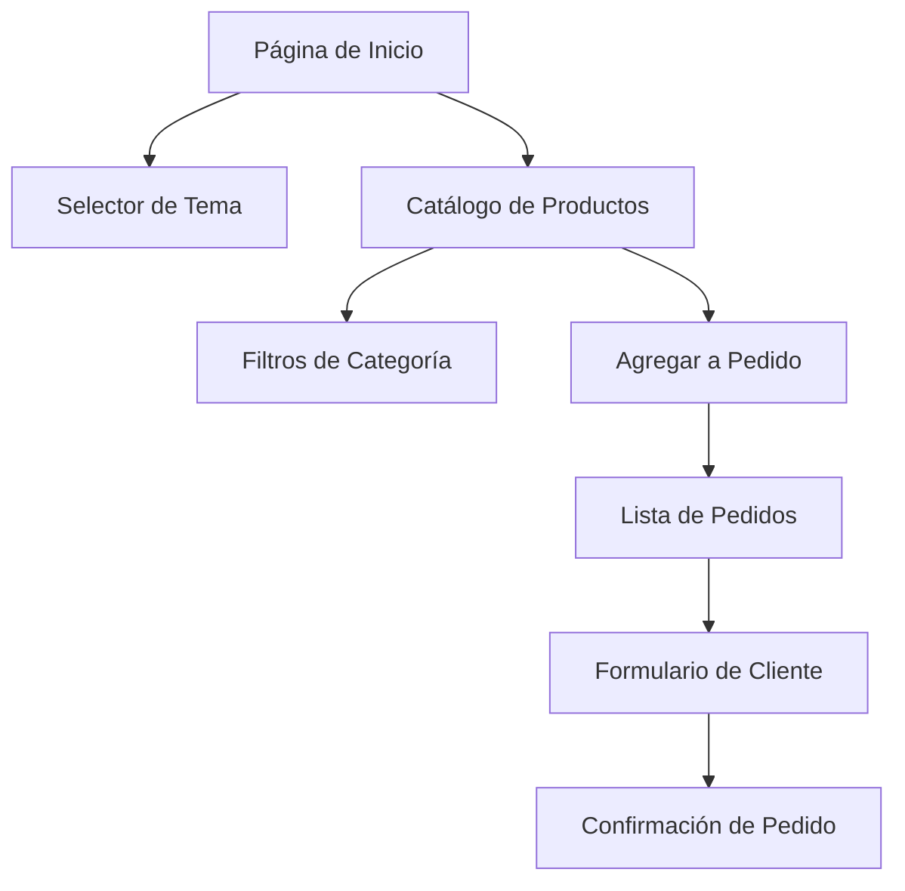

# Documento de Requerimientos del Producto - Tienda Online

## 1. Visión General del Producto
Una tienda online responsiva que permite a los usuarios navegar productos, crear listas de pedidos y gestionar información de contacto. El sitio incluye múltiples temas visuales y está optimizado tanto para dispositivos móviles como de escritorio.

- Soluciona la necesidad de una plataforma de e-commerce simple y atractiva para pequeños negocios
- Dirigido a comerciantes que venden zapatillas, ropa, bolsos y otros productos
- Facilita la gestión de pedidos y comunicación con clientes

## 2. Características Principales

### 2.1 Roles de Usuario
| Rol | Método de Registro | Permisos Principales |
|-----|-------------------|---------------------|
| Cliente | No requiere registro | Puede navegar productos, crear listas de pedidos, proporcionar datos de contacto |
| Administrador | Acceso directo al sistema | Puede gestionar productos mediante JSON, ver pedidos |

### 2.2 Módulo de Características
Nuestros requerimientos de tienda online consisten en las siguientes páginas principales:
1. **Página de Inicio**: selector de tema, menú hamburguesa, catálogo de productos destacados
2. **Catálogo de Productos**: filtros por categoría, vista de productos, botón agregar a pedido
3. **Lista de Pedidos**: productos seleccionados, formulario de datos del cliente, cálculo de total
4. **Configuración de Temas**: selector de tema (oscuro, azul, claro)

### 2.3 Detalles de Páginas
| Nombre de Página | Nombre del Módulo | Descripción de Características |
|------------------|-------------------|--------------------------------|
| Página de Inicio | Selector de Tema | Cambiar entre temas oscuro, azul y claro con colores atractivos |
| Página de Inicio | Menú Hamburguesa | Navegación responsiva para móvil y web con animaciones suaves |
| Página de Inicio | Productos Destacados | Mostrar productos principales con imágenes, precios y botón de agregar |
| Catálogo de Productos | Filtros de Categoría | Filtrar por zapatillas, ropa, bolsos y otros productos |
| Catálogo de Productos | Vista de Productos | Mostrar productos con imagen, nombre, precio, descripción |
| Catálogo de Productos | Agregar a Pedido | Botón para añadir productos a la lista de pedidos |
| Lista de Pedidos | Productos Seleccionados | Mostrar productos agregados con cantidad y subtotal |
| Lista de Pedidos | Formulario de Cliente | Capturar correo, teléfono, dirección del cliente |
| Lista de Pedidos | Cálculo de Total | Calcular y mostrar monto total del pedido |
| Configuración | Gestión de Productos | Administrar productos mediante archivo JSON |

## 3. Proceso Principal
El flujo principal del usuario comienza en la página de inicio donde puede seleccionar un tema visual. Luego navega por el catálogo de productos, filtra por categorías (zapatillas, ropa, bolsos, otros) y agrega productos a su lista de pedidos. Finalmente, completa sus datos de contacto (correo, teléfono, dirección) y confirma el pedido con el monto total calculado.

## 4. Diseño de Interfaz de Usuario
### 4.1 Estilo de Diseño
- **Colores primarios**: 
  - Tema Oscuro: #1a1a1a (fondo), #ffffff (texto), #4f46e5 (acentos)
  - Tema Azul: #1e40af (primario), #3b82f6 (secundario), #ffffff (texto)
  - Tema Claro: #ffffff (fondo), #1f2937 (texto), #10b981 (acentos)
- **Estilo de botones**: Redondeados con sombras suaves y efectos hover
- **Fuentes**: Inter o similar, tamaños 14px-24px
- **Estilo de layout**: Diseño de tarjetas con navegación superior
- **Iconos**: Iconos minimalistas con estilo outline

### 4.2 Resumen de Diseño de Páginas
| Nombre de Página | Nombre del Módulo | Elementos de UI |
|------------------|-------------------|----------------|
| Página de Inicio | Selector de Tema | Botones de tema con vista previa de colores, transiciones suaves |
| Página de Inicio | Menú Hamburguesa | Icono de 3 líneas, menú deslizable lateral, overlay semi-transparente |
| Catálogo | Vista de Productos | Tarjetas de producto con imagen, grid responsivo, botones de acción |
| Lista de Pedidos | Formulario | Campos de entrada con validación, diseño de 2 columnas en desktop |

### 4.3 Responsividad
El producto es mobile-first con adaptación a desktop. Incluye optimización para interacciones táctiles, menú hamburguesa para móvil y grid adaptativo para diferentes tamaños de pantalla.