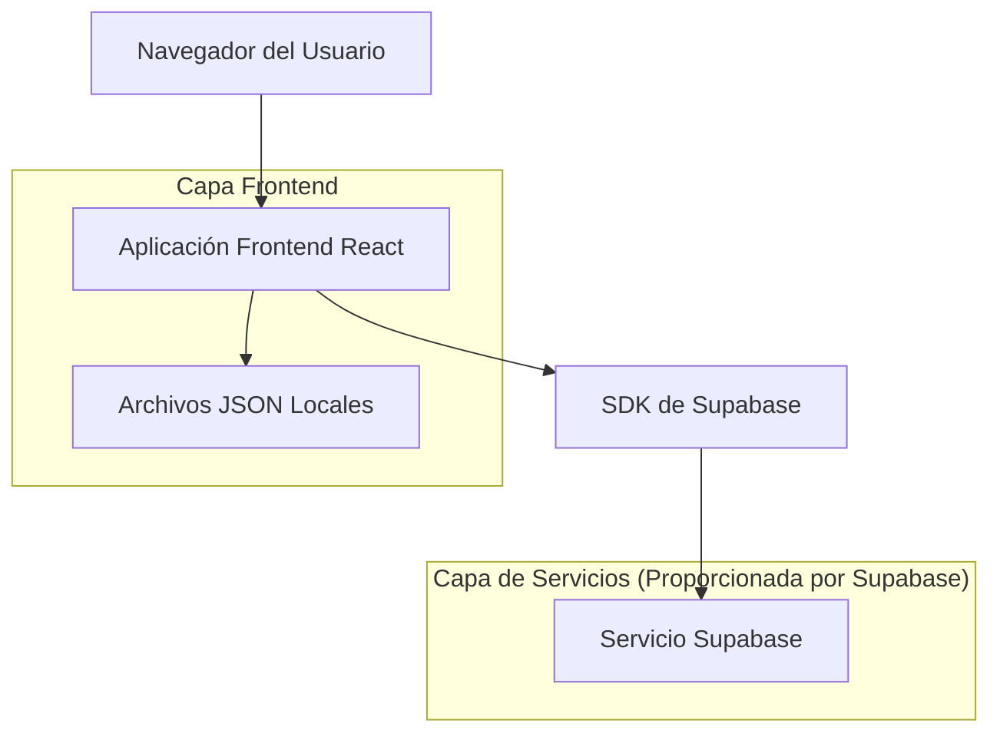
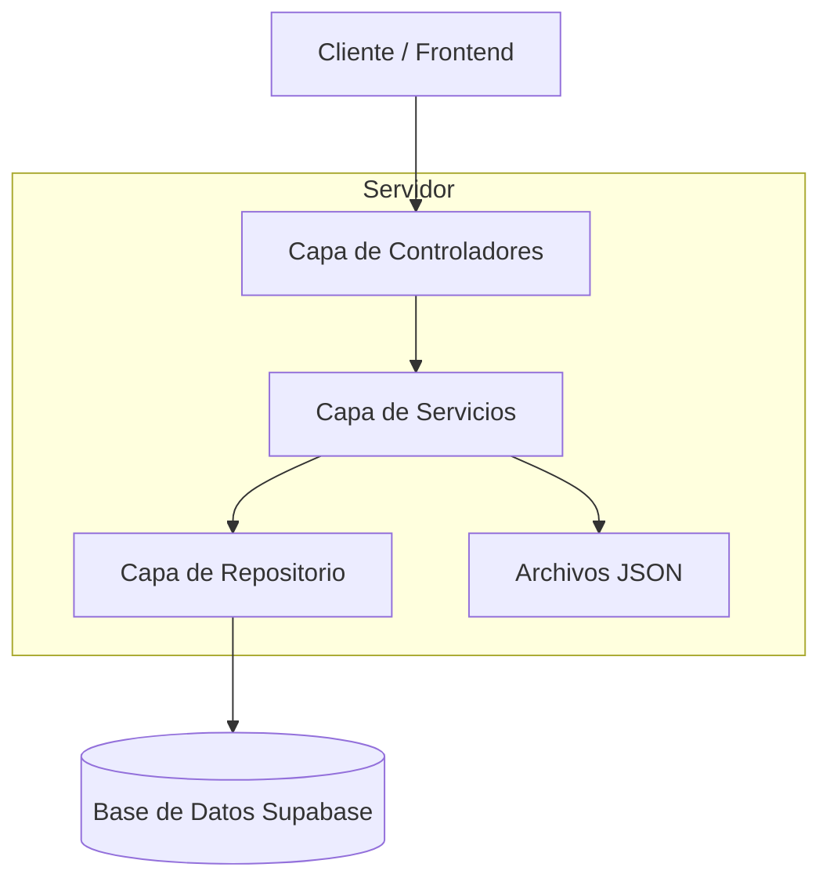
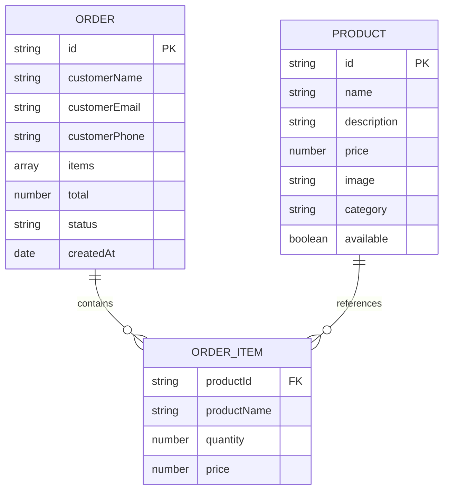

# Documento de Arquitectura Técnica - Tienda Online

## 1. Diseño de Arquitectura



## 2. Descripción de Tecnologías

* Frontend: React\@18 + tailwindcss\@3 + vite

* Backend: Supabase

* Gestión de Estado: React Context API

* Almacenamiento Local: JSON files + localStorage

## 3. Definiciones de Rutas

| Ruta     | Propósito                                                         |
| -------- | ----------------------------------------------------------------- |
| /        | Página de inicio, muestra productos destacados y selector de tema |
| /catalog | Catálogo completo de productos con filtros por categoría          |
| /orders  | Lista de pedidos actual del usuario con formulario de datos       |
| /admin   | Panel de administración para gestión de productos (opcional)      |

## 4. Definiciones de API

### 4.1 API Principal

Gestión de pedidos

```
POST /api/orders
```

Request:

| Nombre del Parámetro | Tipo del Parámetro | Es Requerido | Descripción                     |
| -------------------- | ------------------ | ------------ | ------------------------------- |
| customerEmail        | string             | true         | Correo electrónico del cliente  |
| customerPhone        | string             | true         | Teléfono del cliente            |
| customerAddress      | string             | true         | Dirección del cliente           |
| items                | array              | true         | Lista de productos en el pedido |
| totalAmount          | number             | true         | Monto total del pedido          |

Response:

| Nombre del Parámetro | Tipo del Parámetro | Descripción                |
| -------------------- | ------------------ | -------------------------- |
| success              | boolean            | Estado de la respuesta     |
| orderId              | string             | ID único del pedido creado |

Ejemplo:

```json
{
  "customerEmail": "cliente@email.com",
  "customerPhone": "+1234567890",
  "customerAddress": "Calle Principal 123",
  "items": [
    {
      "id": "prod_001",
      "name": "Zapatillas Nike",
      "price": 89.99,
      "quantity": 1,
      "category": "zapatillas"
    }
  ],
  "totalAmount": 89.99
}
```

Gestión de productos

```
GET /api/products
```

Response:

| Nombre del Parámetro | Tipo del Parámetro | Descripción                              |
| -------------------- | ------------------ | ---------------------------------------- |
| products             | array              | Lista de todos los productos disponibles |

## 5. Diagrama de Arquitectura del Servidor



## 6. Modelo de Datos

### 6.1 Definición del Modelo de Datos



## 7. Gestión de Datos de Productos

### 7.1 Fuente de Datos

Los datos de productos se almacenan en el archivo estático `public/products.json`, que contiene:
- Lista completa de productos con sus propiedades
- Categorías disponibles con descripciones
- Estructura JSON optimizada para carga rápida

### 7.2 Estructura del Archivo JSON

```json
{
  "products": [
    {
      "id": "string",
      "name": "string",
      "description": "string",
      "price": "number",
      "category": "string",
      "image_url": "string",
      "available": "boolean"
    }
  ],
  "categories": [
    {
      "id": "string",
      "name": "string",
      "description": "string"
    }
  ]
}
```

## 9. Estructura de Archivos del Proyecto

### 9.1 Organización General

```
muestras-productos/
├── .trae/                    # Documentación del proyecto
├── public/                   # Archivos estáticos públicos
├── src/                      # Código fuente de la aplicación
│   ├── components/           # Componentes React reutilizables
│   ├── pages/               # Páginas principales de la aplicación
│   ├── stores/              # Gestión de estado con Zustand
│   ├── services/            # Servicios externos (email, WhatsApp)
│   ├── hooks/               # Hooks personalizados de React
│   ├── lib/                 # Utilidades y funciones auxiliares
│   ├── data/                # Configuraciones y datos estáticos
│   └── assets/              # Recursos multimedia
├── netlify.toml             # Configuración de despliegue Netlify
├── package.json             # Dependencias y scripts del proyecto
├── vite.config.ts           # Configuración del bundler Vite
├── tailwind.config.js       # Configuración de Tailwind CSS
└── tsconfig.json            # Configuración de TypeScript
```

### 9.2 Componentes React (`src/components/`)

#### Componentes Principales

**Header.tsx**
- Barra de navegación principal de la aplicación
- Incluye logo, menú de navegación y toggle de tema
- Responsive con menú hamburguesa para móviles
- Integración con `themeStore` para cambio de tema

**HamburgerMenu.tsx**
- Menú desplegable para dispositivos móviles
- Navegación entre páginas principales
- Animaciones suaves de apertura/cierre
- Integración con rutas de React Router

**ThemeProvider.tsx**
- Proveedor de contexto para el sistema de temas
- Maneja la aplicación de temas claro/oscuro
- Persistencia del tema seleccionado

**ThemeToggle.tsx**
- Botón para alternar entre tema claro y oscuro
- Iconos dinámicos (sol/luna)
- Integración con `themeStore`

**Empty.tsx**
- Componente para mostrar estados vacíos
- Usado cuando no hay productos o pedidos
- Diseño consistente con la UI general

#### Componentes de Administración (`src/components/admin/`)

**AdminPanel.tsx**
- Panel principal de administración
- Navegación entre diferentes secciones admin
- Control de acceso y autenticación

**AdminDashboard.tsx**
- Dashboard con métricas y resumen
- Vista general del estado de la tienda
- Accesos rápidos a funciones principales

**ProductManager.tsx**
- Gestión completa de productos
- CRUD de productos (crear, leer, actualizar, eliminar)
- Formularios de edición y validación
- Integración con `productStore`

**OrderManager.tsx**
- Gestión de pedidos de clientes
- Visualización y actualización de estados
- Filtros y búsqueda de pedidos
- Integración con `orderStore`

**CategoryManager.tsx**
- Gestión de categorías de productos
- Creación y edición de categorías
- Organización jerárquica

**LoginForm.tsx**
- Formulario de autenticación para administradores
- Validación de credenciales
- Integración con `authStore`

**PasswordChange.tsx**
- Formulario para cambio de contraseña
- Validación de contraseña actual
- Confirmación de nueva contraseña

**PasswordRecovery.tsx**
- Sistema de recuperación de contraseña
- Envío de emails de recuperación
- Integración con `emailService`

**WhatsAppConfig.tsx**
- Configuración de integración con WhatsApp
- Gestión de números y mensajes predefinidos
- Integración con `whatsappService`

### 9.3 Páginas Principales (`src/pages/`)

**Home.tsx**
- Página de inicio de la aplicación
- Productos destacados y categorías
- Navegación hacia el catálogo
- Diseño atractivo y responsive

**Catalog.tsx**
- Catálogo completo de productos
- Sistema de filtros por categoría
- Grid responsive de productos
- Integración con `productStore` y `cartStore`
- Funcionalidad de búsqueda

**Orders.tsx**
- Página de gestión de pedidos del usuario
- Formulario de datos del cliente
- Resumen del carrito de compras
- Cálculo de totales y envío
- Integración con `orderStore` y `cartStore`

**ProductPreview.tsx**
- Vista detallada de productos individuales
- Carrusel de imágenes (si hay múltiples)
- Información completa del producto
- Botones de acción (agregar al carrito)
- Modal overlay con diseño elegante

### 9.4 Gestión de Estado (`src/stores/`)

**index.ts**
- Exportaciones centralizadas de todos los stores
- Configuración común de Zustand
- Tipos TypeScript compartidos

**productStore.ts**
- Estado global de productos y categorías
- Funciones de carga desde `products.json`
- Filtrado por categoría
- Búsqueda de productos por ID
- Cache y optimización de rendimiento

**cartStore.ts**
- Estado del carrito de compras
- Agregar/remover productos
- Cálculo de cantidades y totales
- Persistencia en localStorage
- Validación de stock

**orderStore.ts**
- Gestión de pedidos de clientes
- Creación y seguimiento de pedidos
- Historial de compras
- Estados de pedido (pendiente, confirmado, enviado)

**authStore.ts**
- Autenticación de administradores
- Gestión de sesiones
- Tokens de acceso
- Permisos y roles

**themeStore.ts**
- Estado del tema de la aplicación
- Persistencia de preferencias
- Aplicación de estilos dinámicos

### 9.5 Servicios Externos (`src/services/`)

**emailService.ts**
- Integración con servicios de email
- Envío de confirmaciones de pedido
- Notificaciones administrativas
- Templates de email personalizados

**whatsappService.ts**
- Integración con WhatsApp Business API
- Envío de mensajes automáticos
- Confirmaciones de pedido por WhatsApp
- Configuración de números y mensajes

### 9.6 Hooks Personalizados (`src/hooks/`)

**useTheme.ts**
- Hook para gestión de temas
- Detección de preferencias del sistema
- Aplicación automática de estilos
- Persistencia de configuración

### 9.7 Utilidades (`src/lib/`)

**utils.ts**
- Funciones auxiliares comunes
- Formateo de precios y fechas
- Validaciones de formularios
- Helpers para manipulación de datos

### 9.8 Configuraciones (`src/data/`)

**whatsapp-config.json**
- Configuración de WhatsApp Business
- Números de contacto
- Mensajes predefinidos
- Templates de comunicación

### 9.9 Archivos de Configuración Raíz

**package.json**
- Dependencias del proyecto (React, Vite, Tailwind, etc.)
- Scripts de desarrollo y build
- Configuración de metadatos del proyecto

**vite.config.ts**
- Configuración del bundler Vite
- Plugins de React y TypeScript
- Optimizaciones de build
- Configuración de desarrollo

**tailwind.config.js**
- Configuración de Tailwind CSS
- Tema personalizado y colores
- Responsive breakpoints
- Plugins adicionales

**tsconfig.json**
- Configuración de TypeScript
- Paths aliases (@/ para src/)
- Opciones de compilación
- Tipos y definiciones

**netlify.toml**
- Configuración de despliegue en Netlify
- Comandos de build
- Redirects para SPA
- Headers de seguridad

**vercel.json**
- Configuración alternativa para Vercel
- Rewrites para API routes
- Configuración de funciones

### 9.10 Archivos Públicos (`public/`)

**products.json**
- Base de datos estática de productos
- Estructura JSON con productos y categorías
- Fuente principal de datos de la aplicación

**favicon.svg**
- Icono de la aplicación
- Formato vectorial escalable

**_redirects**
- Configuración de redirects para Netlify
- Soporte para SPA routing

### 9.11 Documentación (`.trae/documents/`)

**technical_architecture.md**
- Documentación técnica completa
- Arquitectura del sistema
- APIs y modelos de datos

**product_requirements.md**
- Requerimientos del producto
- Funcionalidades principales
- Casos de uso

**admin_panel_documentation.md**
- Documentación del panel administrativo
- Guías de uso para administradores

**postman_collection.md**
- Colección de APIs para testing
- Ejemplos de requests y responses

### 7.3 Gestión de Estado con Zustand

#### ProductStore (`src/stores/productStore.ts`)

```typescript
interface ProductStore {
  products: Product[];
  categories: Category[];
  filteredProducts: Product[];
  selectedCategory: string;
  loadProducts: () => Promise<void>;
  filterByCategory: (category: string) => void;
  getProductById: (id: string) => Product | undefined;
}
```

#### Funciones Principales

- **`loadProducts()`**: Carga datos desde `public/products.json`
- **`filterByCategory()`**: Filtra productos por categoría
- **`getProductById()`**: Obtiene producto específico por ID

### 7.4 API Externa para Imágenes

**Endpoint**: `https://trae-api-us.mchost.guru/api/ide/v1/text_to_image`

**Parámetros**:
- `prompt`: Descripción del producto (URL-encoded)
- `image_size`: Tamaño de imagen (`square_hd`, `portrait_4_3`, etc.)

**Uso en Componentes**:
```typescript
const imageUrl = `https://trae-api-us.mchost.guru/api/ide/v1/text_to_image?prompt=${encodeURIComponent(product.name)}&image_size=square_hd`;
```

### 7.5 Flujo de Datos

```mermaid
graph TD
  A[public/products.json] --> B[productStore.loadProducts()]
  B --> C[Zustand State]
  C --> D[React Components]
  D --> E[Product Cards]
  E --> F[Image API]
  F --> G[Generated Images]
  
  H[User Interaction] --> I[filterByCategory()]
  I --> C
```

### 7.6 Persistencia y Filtrado

- **Carga Inicial**: Al montar la aplicación
- **Filtrado en Tiempo Real**: Sin recarga de página
- **Estado Global**: Compartido entre componentes
- **Optimización**: Filtrado en memoria para mejor rendimiento

### 7.7 Integración con Componentes

#### Catalog Component
```typescript
const { products, filteredProducts, loadProducts, filterByCategory } = useProductStore();
```

#### Product Cards
```typescript
const { getProductById } = useProductStore();
const product = getProductById(productId);
```

## 8. Configuración de Despliegue

### 8.1 Netlify Deployment

#### URLs de Producción

* **Aplicación Principal**: <https://muestras-productos-app.netlify.app>

* **Panel de Administración**: <https://muestras-productos-app.netlify.app/pm>

#### Configuración de Build

```json
{
  "build": {
    "command": "npm run build",
    "publish": "dist"
  }
}
```

#### Configuración SPA (\_redirects)

```
/* /index.html 200
```

### 8.2 Estructura de Archivos de Despliegue

```
dist/
├── index.html
├── assets/
│   ├── index-[hash].js
│   └── index-[hash].css
└── _redirects
```

### 8.3 Variables de Entorno

```
VITE_APP_TITLE=Muestras de Productos
VITE_API_URL=https://muestras-productos-app.netlify.app
```

### 8.4 Estado del Despliegue

* ✅ **Build exitoso** con Vite

* ✅ **SPA routing** configurado

* ✅ **Assets optimizados** y comprimidos

* ✅ **Responsive design** verificado

* ✅ **Performance** optimizado

### 6.2 Lenguaje de Definición de Datos

Tabla de Clientes (customers)

```sql
-- crear tabla
CREATE TABLE customers (
    id UUID PRIMARY KEY DEFAULT gen_random_uuid(),
    email VARCHAR(255) UNIQUE NOT NULL,
    phone VARCHAR(20) NOT NULL,
    address TEXT NOT NULL,
    created_at TIMESTAMP WITH TIME ZONE DEFAULT NOW()
);

-- crear índices
CREATE INDEX idx_customers_email ON customers(email);
CREATE INDEX idx_customers_created_at ON customers(created_at DESC);

-- permisos
GRANT SELECT ON customers TO anon;
GRANT ALL PRIVILEGES ON customers TO authenticated;
```

Tabla de Pedidos (orders)

```sql
-- crear tabla
CREATE TABLE orders (
    id UUID PRIMARY KEY DEFAULT gen_random_uuid(),
    customer_id UUID REFERENCES customers(id),
    total_amount DECIMAL(10,2) NOT NULL,
    status VARCHAR(20) DEFAULT 'pending' CHECK (status IN ('pending', 'confirmed', 'shipped', 'delivered')),
    created_at TIMESTAMP WITH TIME ZONE DEFAULT NOW()
);

-- crear índices
CREATE INDEX idx_orders_customer_id ON orders(customer_id);
CREATE INDEX idx_orders_status ON orders(status);
CREATE INDEX idx_orders_created_at ON orders(created_at DESC);

-- permisos
GRANT SELECT ON orders TO anon;
GRANT ALL PRIVILEGES ON orders TO authenticated;
```

Tabla de Elementos de Pedido (order\_items)

```sql
-- crear tabla
CREATE TABLE order_items (
    id UUID PRIMARY KEY DEFAULT gen_random_uuid(),
    order_id UUID REFERENCES orders(id),
    product_id VARCHAR(50) NOT NULL,
    quantity INTEGER NOT NULL CHECK (quantity > 0),
    unit_price DECIMAL(10,2) NOT NULL
);

-- crear índices
CREATE INDEX idx_order_items_order_id ON order_items(order_id);
CREATE INDEX idx_order_items_product_id ON order_items(product_id);

-- permisos
GRANT SELECT ON order_items TO anon;
GRANT ALL PRIVILEGES ON order_items TO authenticated;
```

Archivo JSON de Productos (products.json)

```json
{
  "products": [
    {
      "id": "zap_001",
      "name": "Zapatillas Deportivas Nike",
      "description": "Zapatillas cómodas para correr y entrenar",
      "price": 89.99,
      "category": "zapatillas",
      "image_url": "/images/nike_shoes.jpg",
      "available": true
    },
    {
      "id": "ropa_001",
      "name": "Camiseta Casual",
      "description": "Camiseta de algodón 100% para uso diario",
      "price": 25.99,
      "category": "ropa",
      "image_url": "/images/casual_shirt.jpg",
      "available": true
    },
    {
      "id": "bolso_001",
      "name": "Bolso de Cuero",
      "description": "Bolso elegante de cuero genuino",
      "price": 129.99,
      "category": "bolsos",
      "image_url": "/images/leather_bag.jpg",
      "available": true
    }
  ],
  "categories": [
    {
      "id": "zapatillas",
      "name": "Zapatillas",
      "description": "Calzado deportivo y casual"
    },
    {
      "id": "ropa",
      "name": "Ropa",
      "description": "Vestimenta para todas las ocasiones"
    },
    {
      "id": "bolsos",
      "name": "Bolsos",
      "description": "Accesorios y bolsos de moda"
    },
    {
      "id": "otros",
      "name": "Otros",
      "description": "Productos diversos"
    }
  ]
}
```

