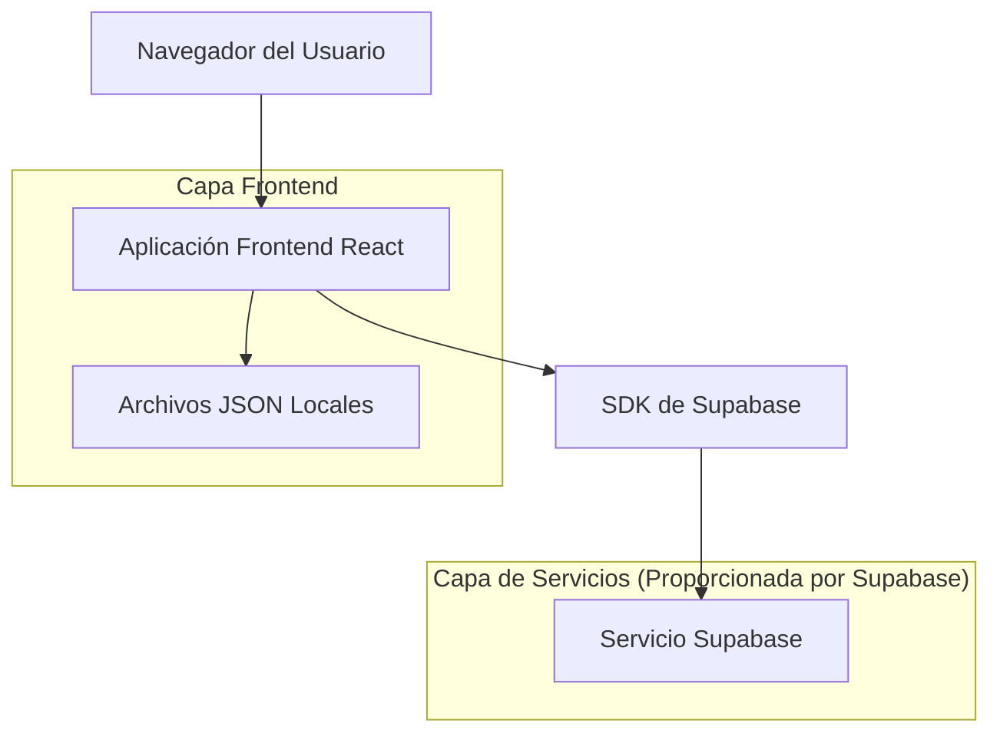
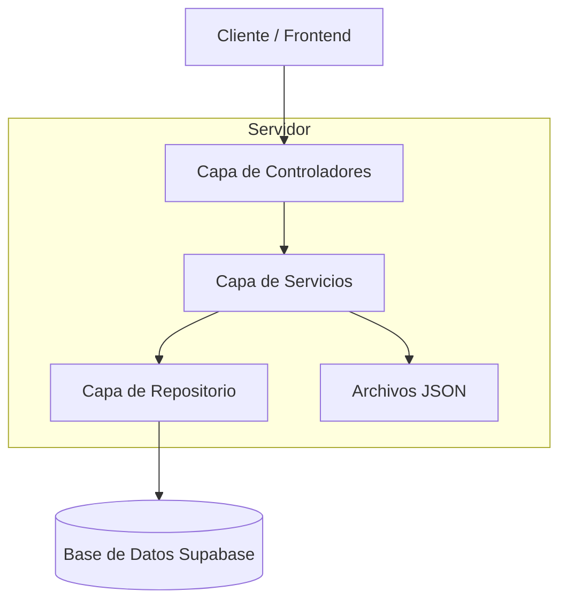
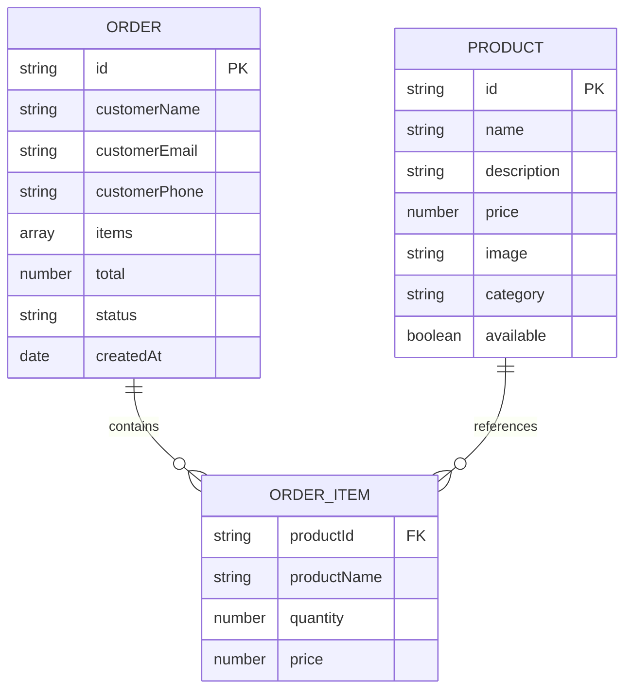

# Documento de Arquitectura Técnica - Tienda Online

## 1. Diseño de Arquitectura



## 2. Descripción de Tecnologías
- Frontend: React@18 + tailwindcss@3 + vite
- Backend: Supabase
- Gestión de Estado: React Context API
- Almacenamiento Local: JSON files + localStorage

## 3. Definiciones de Rutas
| Ruta | Propósito |
|------|----------|
| / | Página de inicio, muestra productos destacados y selector de tema |
| /catalog | Catálogo completo de productos con filtros por categoría |
| /orders | Lista de pedidos actual del usuario con formulario de datos |
| /admin | Panel de administración para gestión de productos (opcional) |

## 4. Definiciones de API
### 4.1 API Principal

Gestión de pedidos
```
POST /api/orders
```

Request:
| Nombre del Parámetro | Tipo del Parámetro | Es Requerido | Descripción |
|---------------------|-------------------|--------------|-------------|
| customerEmail | string | true | Correo electrónico del cliente |
| customerPhone | string | true | Teléfono del cliente |
| customerAddress | string | true | Dirección del cliente |
| items | array | true | Lista de productos en el pedido |
| totalAmount | number | true | Monto total del pedido |

Response:
| Nombre del Parámetro | Tipo del Parámetro | Descripción |
|---------------------|-------------------|-------------|
| success | boolean | Estado de la respuesta |
| orderId | string | ID único del pedido creado |

Ejemplo:
```json
{
  "customerEmail": "cliente@email.com",
  "customerPhone": "+1234567890",
  "customerAddress": "Calle Principal 123",
  "items": [
    {
      "id": "prod_001",
      "name": "Zapatillas Nike",
      "price": 89.99,
      "quantity": 1,
      "category": "zapatillas"
    }
  ],
  "totalAmount": 89.99
}
```

Gestión de productos
```
GET /api/products
```

Response:
| Nombre del Parámetro | Tipo del Parámetro | Descripción |
|---------------------|-------------------|-------------|
| products | array | Lista de todos los productos disponibles |

## 5. Diagrama de Arquitectura del Servidor


## 6. Modelo de Datos

### 6.1 Definición del Modelo de Datos


## 7. Configuración de Despliegue

### 7.1 Netlify Deployment

#### URLs de Producción
- **Aplicación Principal**: https://muestras-productos-app.netlify.app
- **Panel de Administración**: https://muestras-productos-app.netlify.app/pm

#### Configuración de Build
```json
{
  "build": {
    "command": "npm run build",
    "publish": "dist"
  }
}
```

#### Configuración SPA (_redirects)
```
/* /index.html 200
```

### 7.2 Estructura de Archivos de Despliegue
```
dist/
├── index.html
├── assets/
│   ├── index-[hash].js
│   └── index-[hash].css
└── _redirects
```

### 7.3 Variables de Entorno
```
VITE_APP_TITLE=Muestras de Productos
VITE_API_URL=https://muestras-productos-app.netlify.app
```

### 7.4 Estado del Despliegue
- ✅ **Build exitoso** con Vite
- ✅ **SPA routing** configurado
- ✅ **Assets optimizados** y comprimidos
- ✅ **Responsive design** verificado
- ✅ **Performance** optimizado

### 6.2 Lenguaje de Definición de Datos

Tabla de Clientes (customers)
```sql
-- crear tabla
CREATE TABLE customers (
    id UUID PRIMARY KEY DEFAULT gen_random_uuid(),
    email VARCHAR(255) UNIQUE NOT NULL,
    phone VARCHAR(20) NOT NULL,
    address TEXT NOT NULL,
    created_at TIMESTAMP WITH TIME ZONE DEFAULT NOW()
);

-- crear índices
CREATE INDEX idx_customers_email ON customers(email);
CREATE INDEX idx_customers_created_at ON customers(created_at DESC);

-- permisos
GRANT SELECT ON customers TO anon;
GRANT ALL PRIVILEGES ON customers TO authenticated;
```

Tabla de Pedidos (orders)
```sql
-- crear tabla
CREATE TABLE orders (
    id UUID PRIMARY KEY DEFAULT gen_random_uuid(),
    customer_id UUID REFERENCES customers(id),
    total_amount DECIMAL(10,2) NOT NULL,
    status VARCHAR(20) DEFAULT 'pending' CHECK (status IN ('pending', 'confirmed', 'shipped', 'delivered')),
    created_at TIMESTAMP WITH TIME ZONE DEFAULT NOW()
);

-- crear índices
CREATE INDEX idx_orders_customer_id ON orders(customer_id);
CREATE INDEX idx_orders_status ON orders(status);
CREATE INDEX idx_orders_created_at ON orders(created_at DESC);

-- permisos
GRANT SELECT ON orders TO anon;
GRANT ALL PRIVILEGES ON orders TO authenticated;
```

Tabla de Elementos de Pedido (order_items)
```sql
-- crear tabla
CREATE TABLE order_items (
    id UUID PRIMARY KEY DEFAULT gen_random_uuid(),
    order_id UUID REFERENCES orders(id),
    product_id VARCHAR(50) NOT NULL,
    quantity INTEGER NOT NULL CHECK (quantity > 0),
    unit_price DECIMAL(10,2) NOT NULL
);

-- crear índices
CREATE INDEX idx_order_items_order_id ON order_items(order_id);
CREATE INDEX idx_order_items_product_id ON order_items(product_id);

-- permisos
GRANT SELECT ON order_items TO anon;
GRANT ALL PRIVILEGES ON order_items TO authenticated;
```

Archivo JSON de Productos (products.json)
```json
{
  "products": [
    {
      "id": "zap_001",
      "name": "Zapatillas Deportivas Nike",
      "description": "Zapatillas cómodas para correr y entrenar",
      "price": 89.99,
      "category": "zapatillas",
      "image_url": "/images/nike_shoes.jpg",
      "available": true
    },
    {
      "id": "ropa_001",
      "name": "Camiseta Casual",
      "description": "Camiseta de algodón 100% para uso diario",
      "price": 25.99,
      "category": "ropa",
      "image_url": "/images/casual_shirt.jpg",
      "available": true
    },
    {
      "id": "bolso_001",
      "name": "Bolso de Cuero",
      "description": "Bolso elegante de cuero genuino",
      "price": 129.99,
      "category": "bolsos",
      "image_url": "/images/leather_bag.jpg",
      "available": true
    }
  ],
  "categories": [
    {
      "id": "zapatillas",
      "name": "Zapatillas",
      "description": "Calzado deportivo y casual"
    },
    {
      "id": "ropa",
      "name": "Ropa",
      "description": "Vestimenta para todas las ocasiones"
    },
    {
      "id": "bolsos",
      "name": "Bolsos",
      "description": "Accesorios y bolsos de moda"
    },
    {
      "id": "otros",
      "name": "Otros",
      "description": "Productos diversos"
    }
  ]
}
```