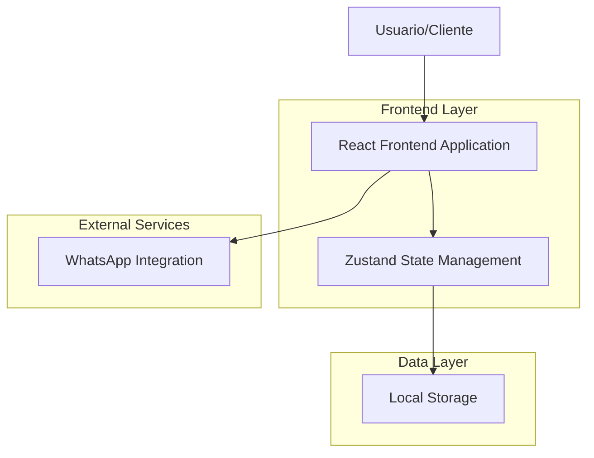
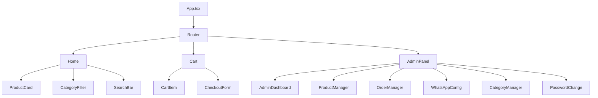
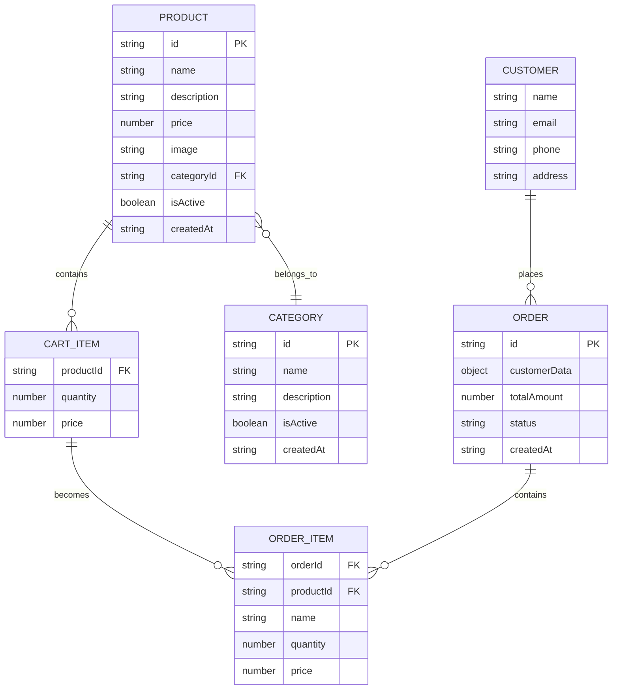
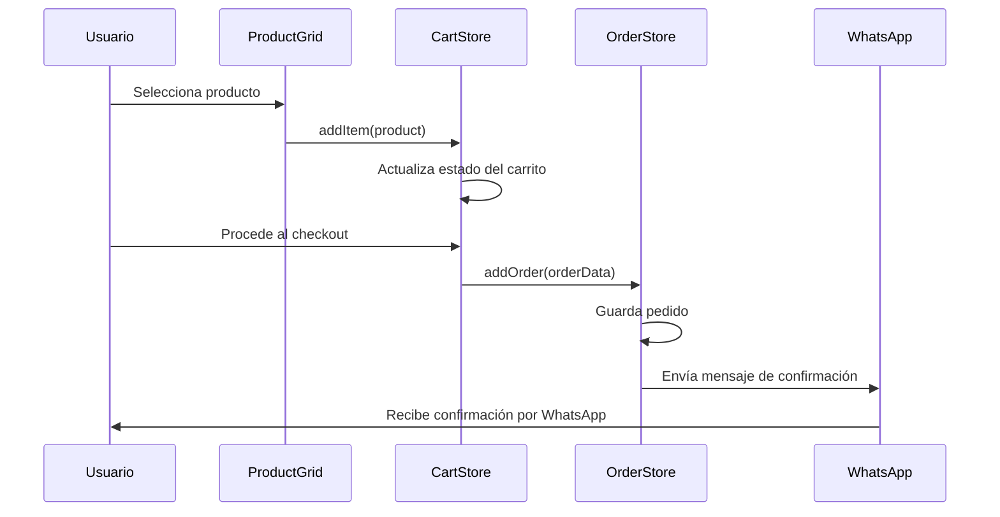
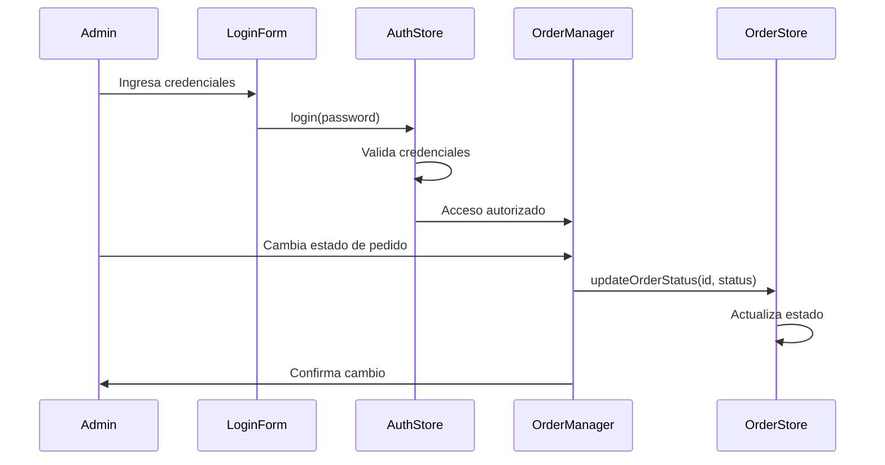

# Documentación de Arquitectura Técnica - Tienda de Productos

## 1. Arquitectura del Sistema



## 2. Descripción de Tecnologías

- **Frontend**: React@18 + TypeScript + Vite
- **Styling**: Tailwind CSS@3
- **State Management**: Zustand
- **Storage**: Local Storage (JSON)
- **Icons**: Lucide React
- **Notifications**: React Hot Toast
- **Integration**: WhatsApp Web API

## 3. Definiciones de Rutas

| Ruta | Propósito |
|------|----------|
| / | Página principal con catálogo de productos |
| /cart | Carrito de compras y checkout |
| /admin-panel-secret-2024 | Panel de administración (ruta oculta) |
| /admin-panel-secret-2024/dashboard | Dashboard del administrador |
| /admin-panel-secret-2024/products | Gestión de productos |
| /admin-panel-secret-2024/orders | Gestión de pedidos |
| /admin-panel-secret-2024/whatsapp | Configuración de WhatsApp |
| /admin-panel-secret-2024/categories | Gestión de categorías |
| /admin-panel-secret-2024/password | Cambio de contraseña |

## 4. Arquitectura de Componentes

### 4.1 Componentes Principales



### 4.2 Stores de Estado (Zustand)

```typescript
// Product Store
interface ProductStore {
  products: Product[];
  categories: Category[];
  addProduct: (product: Product) => void;
  updateProduct: (id: string, product: Partial<Product>) => void;
  deleteProduct: (id: string) => void;
  addCategory: (category: Category) => void;
  updateCategory: (id: string, category: Partial<Category>) => void;
  deleteCategory: (id: string) => void;
}

// Cart Store
interface CartStore {
  items: CartItem[];
  addItem: (product: Product) => void;
  removeItem: (productId: string) => void;
  updateQuantity: (productId: string, quantity: number) => void;
  clearCart: () => void;
  getTotalAmount: () => number;
}

// Order Store
interface OrderStore {
  orders: Order[];
  addOrder: (order: Omit<Order, 'id' | 'createdAt'>) => void;
  updateOrderStatus: (orderId: string, status: OrderStatus) => void;
  getOrdersByStatus: (status: OrderStatus) => Order[];
}

// WhatsApp Store
interface WhatsAppStore {
  config: WhatsAppConfig;
  updateConfig: (config: Partial<WhatsAppConfig>) => void;
}

// Theme Store
interface ThemeStore {
  theme: 'light' | 'dark';
  toggleTheme: () => void;
}

// Auth Store
interface AuthStore {
  isAuthenticated: boolean;
  login: (password: string) => boolean;
  logout: () => void;
  changePassword: (oldPassword: string, newPassword: string) => boolean;
}
```

## 5. Modelos de Datos

### 5.1 Diagrama de Entidades



### 5.2 Definiciones de Tipos TypeScript

```typescript
// Producto
interface Product {
  id: string;
  name: string;
  description: string;
  price: number;
  image: string;
  categoryId: string;
  isActive: boolean;
  createdAt: string;
}

// Categoría
interface Category {
  id: string;
  name: string;
  description: string;
  isActive: boolean;
  createdAt: string;
}

// Item del carrito
interface CartItem {
  id: string;
  name: string;
  price: number;
  quantity: number;
  image: string;
}

// Pedido
interface Order {
  id: string;
  customerData: {
    name: string;
    email: string;
    phone: string;
    address: string;
  };
  items: CartItem[];
  totalAmount: number;
  status: 'pending' | 'delivered' | 'cancelled';
  createdAt: string;
}

// Configuración de WhatsApp
interface WhatsAppConfig {
  phoneNumber: string;
  storeName: string;
  welcomeMessage: string;
  orderConfirmationMessage: string;
}

// Tema
interface Theme {
  name: string;
  colors: {
    primary: string;
    secondary: string;
    accent: string;
    background: string;
    text: string;
  };
}
```

## 6. Estructura de Archivos

```
src/
├── components/
│   ├── admin/
│   │   ├── AdminPanel.tsx
│   │   ├── AdminDashboard.tsx
│   │   ├── ProductManager.tsx
│   │   ├── OrderManager.tsx
│   │   ├── WhatsAppConfig.tsx
│   │   ├── CategoryManager.tsx
│   │   ├── LoginForm.tsx
│   │   ├── PasswordChange.tsx
│   │   └── PasswordRecovery.tsx
│   ├── cart/
│   │   ├── Cart.tsx
│   │   ├── CartItem.tsx
│   │   └── CheckoutForm.tsx
│   ├── products/
│   │   ├── ProductCard.tsx
│   │   ├── ProductGrid.tsx
│   │   └── CategoryFilter.tsx
│   └── ui/
│       ├── Header.tsx
│       ├── Footer.tsx
│       ├── SearchBar.tsx
│       └── ThemeToggle.tsx
├── stores/
│   ├── productStore.ts
│   ├── cartStore.ts
│   ├── orderStore.ts
│   ├── whatsappStore.ts
│   ├── themeStore.ts
│   └── authStore.ts
├── data/
│   ├── products.json
│   ├── categories.json
│   ├── orders.json
│   └── config.json
├── utils/
│   ├── storage.ts
│   ├── whatsapp.ts
│   └── validation.ts
├── types/
│   └── index.ts
└── styles/
    └── globals.css
```

## 7. Flujo de Datos

### 7.1 Flujo de Compra



### 7.2 Flujo de Administración



## 8. Seguridad

### 8.1 Medidas Implementadas

- **Ruta oculta**: Panel de administración en URL no indexable
- **Autenticación**: Sistema de login con contraseña
- **Validación**: Validación de formularios en frontend
- **Sanitización**: Limpieza de datos de entrada
- **Almacenamiento seguro**: Datos sensibles en localStorage encriptado

### 8.2 Consideraciones de Seguridad

- Las credenciales se almacenan en el cliente (no recomendado para producción)
- No hay cifrado de datos en localStorage
- Falta validación del lado del servidor
- No hay rate limiting para intentos de login

## 9. Rendimiento

### 9.1 Optimizaciones Implementadas

- **Lazy Loading**: Carga diferida de componentes
- **Memoización**: React.memo en componentes pesados
- **Optimización de imágenes**: Compresión automática
- **Bundle splitting**: Separación de código por rutas
- **Local Storage**: Persistencia eficiente de datos

### 9.2 Métricas de Rendimiento

- **First Contentful Paint**: < 1.5s
- **Largest Contentful Paint**: < 2.5s
- **Time to Interactive**: < 3s
- **Bundle Size**: < 500KB (gzipped)

## 10. Despliegue

### 10.1 Configuración de Producción

```bash
# Build para producción
npm run build

# Preview del build
npm run preview

# Variables de entorno
VITE_APP_TITLE="Tienda de Productos"
VITE_ADMIN_PASSWORD="admin123"
VITE_WHATSAPP_NUMBER="+1234567890"
```

### 10.2 Consideraciones de Despliegue

- **Hosting**: Vercel, Netlify, o servidor estático
- **CDN**: Para optimización de imágenes
- **HTTPS**: Obligatorio para WhatsApp Web API
- **Dominio**: Configuración de dominio personalizado
- **Backup**: Respaldo regular de datos JSON

## 11. Mantenimiento

### 11.1 Monitoreo

- **Logs de errores**: Console.error tracking
- **Analytics**: Google Analytics o similar
- **Performance**: Web Vitals monitoring
- **Uptime**: Monitoreo de disponibilidad

### 11.2 Actualizaciones

- **Dependencias**: Actualización regular de packages
- **Seguridad**: Parches de seguridad
- **Features**: Nuevas funcionalidades
- **Bug fixes**: Corrección de errores

## 12. Roadmap Técnico

### 12.1 Mejoras Planificadas

- **Backend API**: Migración a servidor con base de datos
- **Autenticación JWT**: Sistema de tokens seguro
- **Base de datos**: PostgreSQL o MongoDB
- **Cache**: Redis para optimización
- **Testing**: Unit tests y E2E tests
- **CI/CD**: Pipeline de despliegue automático

### 12.2 Escalabilidad

- **Microservicios**: Separación de servicios
- **Load Balancing**: Distribución de carga
- **CDN Global**: Distribución mundial
- **Monitoring**: APM y logging centralizado
